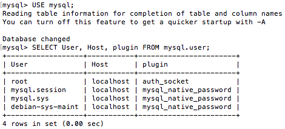

# Datadog Coding Challenge - Bradley Shields

Hello Datadog, here is my livedoc created while completing the Coding Challenge. The first section covers my initial test for markdown and image embedding, the answers begin at "Prerequisites - Setup the Environment." 

Thank you for the opportunity to interview, I hope to speak with you soon.

## Format Testing - Embedding Images:

To be sure I knew how to embed my screenshots, and that my markdown formatting displayed as I expected, I created the repository [datadog_test](https://github.com/bradleyjay/datadog_test). I tried two methods to embed images from github's "Mastering Markdown" [guide.](https://guides.github.com/features/mastering-markdown/)

1. Absolute github path

`````` 

This works, but that's not necessarily a static URL. Depending on the branch referenced, that URL grows to include the branch name, and "tree". That's risky as things change in the repo.

2. Relative github path

``` ```


In this case, a relative path works better because it moves with the README.md in a given branch, which in this case is where I'm embedding the image. And so,


Check complete! There's our fearless leader, Tormund Giantsbane (ginger beards of the world, unite!) Now, to set up the enviornment for the Coding Challenge.

*Note: on macOS, to screenshot, use Shift+CMD+4*


## Prerequisites - Setup the Environment

#### Initial VM Install and Launch

Having used Docker briefly before, I was curious to learn about Vagrant. I followed the [guide](https://www.vagrantup.com/intro/getting-started/) for setting up a Vagrant Virtual Machine(VM) project:
- Downloaded and installed [Vagrant](https://www.vagrantup.com/downloads.html) 2.1.2 for macOS.
- Per Vagrant's recommendation, updated my [VirtualBox](https://www.virtualbox.org/wiki/Downloads) install to 5.2.18. 

Then, I tested launching the VM via

    vagrant init hashicorp/precise64
    vagrant up 

And accessed the VM via ```vagrant ssh```. We're in, great news.

#### VM Customization

With our VM up and running, that's great, but the DataDog coding challenge specifically recommends running Ubuntu v.16.04. By default, Vagrant VM boots into Ubuntu 12.04 LTS. Let's change that to ensure our dependencies are in-line for the Datadog Agent.

Vagrant base images are called "boxes," and cloning one is how a VirtualBox environment is chosen. From the [Box Catalog](https://app.vagrantup.com/boxes/search?page=1&provider=virtualbox&q=ubuntu+16.04&sort=downloads&utf8=%E2%9C%93) I found [Ubuntu 16.04 LTS](https://app.vagrantup.com/ubuntu/boxes/xenial64). Adding the ```config.vm.box``` line to our Vagrantfile like so:

    Vagrant.configure("2") do |config|
       config.vm.box = "ubuntu/xenial64"
    end

 gave me access to this box. I then commented out the previous ```config.vm.box``` line to deselect Ubuntu 12.04 LTS. This version of the virtual box was already running, so a ```vagrant destroy``` was used to remove that instance of the virtual machine. 

 I then ran a ```vagrant up```, which downloaded the new 16.04 LTS box and started our new server. Finally, ```vagrant ssh``` brought me into the new version of the box. Upon launch, there is a message about Ubuntu 18.04.1 LTS being available, but I wanted to use 16.04 LTS unless I find stability or dependency issues. The Ubuntu 16.04 LTS box has *many* more downloads, so the odds seem good that it's a stable release, despite being a daily build.


#### Datadog Agent Setup

As instructed, I signed up for Datadog as a "Datadog Recruiting Candidate", then informed Datadog about my stack (Python, MySQL, GitHub, Slack). For the Agent Setup, I chose Ubuntu (since we'll be using our VM, not my local macOS), and applied the provided command to our Vagrant box:

```DD_API_KEY=8677a7b08834961d73c4e0e22dbd6e07 bash -c "$(curl -L https://raw.githubusercontent.com/DataDog/datadog-agent/master/cmd/agent/install_script.sh)"```

After a number of get, unpack, and install calls, the Datadog Agent reported it was running and functioning properly. For reference, the installer reported at the end:

    If you ever want to stop the Agent, run:

        ```sudo systemctl stop datadog-agent```

    And to run it again run:

        ```sudo systemctl start datadog-agent```


## Collecting Metrics

Now, the assignment.

**Add tags in the Agent config file and show us a screenshot of your host and its tags on the Host Map page in Datadog.**

###### Step 1: Find the Agent config file
At this point, I went to the Datadog [overview](https://docs.datadoghq.com/) documentation, and opened up the Agent section. Selecting [Ubuntu](https://docs.datadoghq.com/agent/basic_agent_usage/ubuntu/) and reading down the page, the Agent config file location is listed. Looking through the Datadog Agent Installer output in my VM terminal window, I could see Agent V6 was installed, not V5. The Agent config file is therefore located at ```/etc/datadog-agent/datadog.yaml```.

###### Step 2: Add tags to the config file.
By searching the Datadog Docs documentation for **tags**, I found an [article](https://docs.datadoghq.com/tagging/assigning_tags/) on assigning tags. ["Getting Started With Tags"](https://docs.datadoghq.com/tagging/#tags-best-practices) had some recommendations for useful tags and notes on formatting.

I attempted to use **vi** to open the datadog.yaml, but was denied due to permissions. **Sudo** let me through. Using **/tags** to find the section on tags, I set the following:

    # Set the host's tags (optional)
        tags: machine_name: VagrantVM_Ubuntu1604LTS, region:eastus, env:prod, role:database

*Aside: I notice this mistake later, that there's an extra space between **machine_name:** and **VagrantVM_Ubuntu1604LTS** When I see the Hostmap in the next step, I do immediately notice that my custom tags aren't there, but decided that there may be another later step that updates the Host's info after some investigating. After setting up my MySQL integration in the next part of "Collecting Metrics," I realize that's not the case when more information is missing. There's more explanation at that point in this document, as you'll see - please keep reading for now. I came back to replace the above two lines with:*

    # Set the host's tags (optional)
        tags: machine_name:VagrantVM_Ubuntu1604LTS, region:eastus, env:prod, role:database 


###### Step 3: Find Hostmap in Datadog, provide screenshot
Back in the browser walk-through for setting up Datadog, from my notes on the Datadog 101 - 1 - Overview [video](https://www.youtube.com/watch?v=uI3YN_cnahk) the Hostmap should be in the Sidebar menu. From **Infrastructure > Hostmap**, 


**Install a database on your machine (MongoDB, MySQL, or PostgreSQL) and then install the respective Datadog integration for that database.** 

###### Step 1: Install a database (MySQL)

Following the Debian/Ubuntu apt-get install workflow [guide](https://dev.mysql.com/doc/mysql-apt-repo-quick-guide/en/#apt-repo-fresh-install), I installed via ```sudo apt-get install mysql-server```, and left the root password blank. Of course, that's not secure, but for the proof of concept we're doing here, simplicity seemed wise. I found this [guide](https://www.digitalocean.com/community/tutorials/how-to-install-mysql-on-ubuntu-16-04) useful as well.

I confirmed the SQL server was running via ```systemctl status mysql.service```. The second check to make sure MySQL was running **and** user accessible, done by a version check via ```mysqladmin -p -u root version```

    vagrant@ubuntu-xenial:~$ mysqladmin -u root version
    mysqladmin: connect to server at 'localhost' failed
    error: 'Access denied for user 'root'@'localhost''

I've seen this before - it's related to the default auth_socket plugin (MySQL does this on macOS too). This [Stack Overflow](https://stackoverflow.com/questions/39281594/error-1698-28000-access-denied-for-user-rootlocalhost) helped resolve the issue. The user root is using the **auth_socket** plugin by default, as below:



The solution is to grant permissions to the user and use SQL that way (i.e., as vagrant@ubuntu-xenial). So,

    vagrant@ubuntu-xenial:~$ sudo mysql -u root
    mysql> USE mysql
    mysql> CREATE USER 'vagrant'@'localhost' IDENTIFIED BY '';
    mysql> GRANT ALL PRIVILEGES ON *.* TO 'vagrant'@'localhost';
    mysql> UPDATE user SET plugin='auth_socket' WHERE User='vagrant';
    mysql> FLUSH PRIVILEGES;
    sudo service mysql restart

Then, ```mysqladmin -u vagrant version``` correctly outputs the version, indicating that our MySQL service is up, running, and user accessible. ```mysql -u vagrant``` can now get us to the MySQL monitor to interact with our MySQL service as necessary.

###### Step 2: Install the Corresponding Integration for that Database (MySQL)

From the [MySQL Integration Documentation](https://docs.datadoghq.com/integrations/mysql/), MySQL integration comes with the Datadog Agent installation. For configuration, ```conf.d/mysql.d/conf.yaml``` must be editted in the Agent's [configuration directory](https://docs.datadoghq.com/agent/faq/agent-configuration-files/#agent-configuration-directory), which for Linux is ```/etc/datadog-agent/conf.d/```.

Before doing that, the SQL must be prepared by creating a user for Datadog (actual documentation, I would of course **never** list the password, as I've done here). These commands use @'localhost', which will work for our single host proof of concept:

    vagrant@ubuntu-xenial:/etc/datadog-agent/conf.d$ sudo mysql -u root
    mysql> CREATE USER 'datadog'@'localhost' IDENTIFIED BY 'datadog';

As in the documentation, user creation is verified via:

    mysql -u datadog --password=datadog -e "show status" | \
    grep Uptime && echo -e "\033[0;32mMySQL user - OK\033[0m" || \
    echo -e "\033[0;31mCannot connect to MySQL\033[0m"
    mysql -u datadog --password=datadog -e "show slave status" && \
    echo -e "\033[0;32mMySQL grant - OK\033[0m" || \
    echo -e "\033[0;31mMissing REPLICATION CLIENT grant\033[0m"

Which then yields an "access denied" error, as expected. To grant the necessary replication client privileges, I log in as root (this didn't work when logging into MySQL as Datadog):

    vagrant@ubuntu-xenial:/etc/datadog-agent/conf.d$ sudo mysql -u root
    mysql> GRANT REPLICATION CLIENT ON *.* TO 'datadog'@'localhost' WITH MAX_USER_CONNECTIONS 5;
    mysql> GRANT PROCESS ON *.* TO 'datadog'@'localhost';

To enable metric collection from the performance_schema database:

    mysql> show databases like 'performance_schema';
    mysql> GRANT SELECT ON performance_schema.* TO 'datadog'@'localhost';

And finally, to start gathering MySQL metrics, we need add some code config file. However, only the example file conf.yaml.example exists in ```/etc/datadog-agent/conf.d/mysql.d```, so I copy the example to make my own version via```cp conf.yaml.example conf.yaml```. This creates conf.yaml, but the file belongs to root. Finally, I use ```sudo chown dd-agent:dd-agent conf.yaml``` to change ownership properly to the dd-agent.

Now, we can modify to ```mysql.d/conf.yaml```, replacing the commented-out lines in the example with those listed in the documentation (using **sudo vi**, as the file is read-only). My conf.yaml then looks like:


*Aside: After restarting the Agent, I notice in the Datadog dashboard that I can't see my MySQL integration info on my host. I was curious before, when my tags didn't show up in the HostMap, despite being set in my config.yaml file. ```sudo datadog-agent status``` reports that it cannot load the Datadog config file, specifically related to mapping values under the "host tags" section. Opening the config.yaml, I see that I've left an extra space in-between one of my tag key:value pairs. After fixing that, then running ```sudo service datadog-agent start```, and finally the status query again, I can see the Agent is up and running correctly, this time. At this point, I've gone back and updated the HostMap image for my answer under Part 1 of this section, "Collecting Metrics."*

